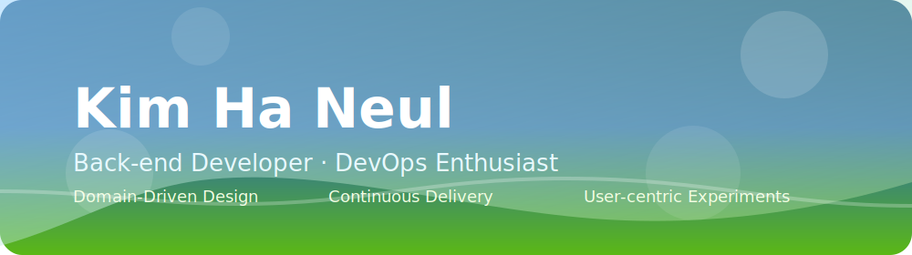

  
  

## 👋 About Me

안녕하세요, 사용자 가치에 집중하는 백엔드 개발자 **김하늘**입니다.
탄탄한 서버 아키텍처와 데이터 품질을 바탕으로 "문제를 명확히 정의하고 해결책을 실행으로 연결하는 개발자"가 되기 위해 꾸준히 성장하고 있습니다.

- **Spring Boot · JPA** 중심의 서비스 개발과 API 디자인 경험
- **Android(Kotlin), TypeScript**를 활용한 풀스택 협업 경험으로 프런트엔드와의 소통에 강점
- **AWS, Docker** 인프라 운영과 모니터링 자동화로 실서비스 품질 개선 실험

> 목표는 "사용자가 신뢰할 수 있는 서비스를 안정적으로 제공"하는 것입니다. 이를 위해 테스트, 문서화, 모니터링을 습관화하고 있습니다.

 

## 🌟 What I'm Focusing On

- 데이터 무결성과 성능을 고려한 **도메인 모델 설계**
- **테스트 코드와 자동화 파이프라인**을 통한 반복 가능한 개발 환경 구축

 

## 💼 Spotlight Projects

| Project | Stack & 역할 | Highlights |
| --- | --- | --- |
| **[Green Coach](https://github.com/c1oud-dev/Green_Coach)** | Kotlin · Android · Firebase | 쓰레기 분리수거 가이드를 제공하는 모바일 앱. MVVM 아키텍처로 설계하고, 실시간 데이터 동기화를 위해 Firebase를 적용했습니다. UI/UX 개선과 테스트 사용자 피드백을 기반으로 기능을 다듬었습니다. |
| **[Booktine](https://github.com/c1oud-dev/Booktine)** | TypeScript · Next.js · Zustand | 독서 습관을 관리하는 웹 서비스. 독서 플래너, 통계 시각화, 반응형 디자인을 구현하고 Vercel을 통해 배포했습니다. 코드 스플리팅과 API 최적화로 초기 로딩 속도를 개선했습니다. |

> 더 많은 프로젝트와 회고는 [GitHub Repositories](https://github.com/c1oud-dev?tab=repositories)와 [기술 블로그](https://dev-cloud.tistory.com/)에서 확인하실 수 있습니다.

 

## 🛠 Tech Stack

### Core

### Familiar

### DevOps & Tooling

 

## 📝 Learning & Writing

* 기술 블로그: [dev-cloud.tistory.com](https://dev-cloud.tistory.com/) – 프로젝트 회고, 에러 핸들링, 아키텍처 고민을 기록합니다.
* Solved.ac: [gksmf4165](https://solved.ac/profile/gksmf4165) – 꾸준한 알고리즘 문제 해결로 사고력을 확장하고 있습니다.

 

## 📊 Activity

